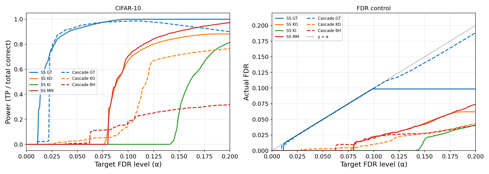
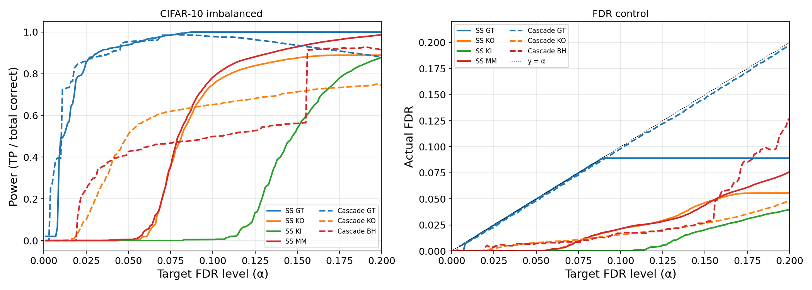

<div align="center">

# Multiclass False Discovery Rate Control

### Reliable neural-network predictions through selective classification

[Laboratory on AI for Computational Biology](https://cs.hse.ru/ai/aic/)

Research code for a manuscript in preparation. This public repository contains the FDR experiments and prepared logits; the classifier and ENGPE training code are not included.

[](https://www.python.org/)
[](code/simulations_clean.ipynb)
[](paper/multiclass_fdr_preview.pdf)

[Read the paper](paper/multiclass_fdr_preview.pdf) ·
[Download the PDF](https://github.com/followviny/Multiclass-FDR/raw/refs/heads/main/paper/multiclass_fdr_report.pdf) ·
[Explore the experiments](code/simulations_clean.ipynb)

</div>

<p align="center">
  
</p>

## What this project is about

A neural network normally returns a class for every input—even when its prediction is unreliable. This project adds a **statistical decision layer** on top of a multiclass classifier:

```text
image → neural network → class logits → FDR procedure → accept prediction / abstain
```

The goal is to accept as many correct predictions as possible while keeping the expected fraction of mistakes among all accepted predictions below a chosen level `α`:

```text
FDR = E[wrong accepted predictions / max(all accepted predictions, 1)] ≤ α
```

This is a machine-learning reliability problem known as **selective classification**. The classifier produces the logits; the FDR procedure decides which predictions are trustworthy enough to keep.

## Why multiclass FDR is difficult

In binary testing, the null hypothesis is usually clear. After a multiclass `argmax`, an accepted mistake can instead come from two different sources:

- an out-of-distribution sample that belongs to none of the known classes;
- an in-distribution sample assigned to the wrong class.

Pooling these cases into a naive empirical null can produce invalid p-values. The paper studies how to estimate false discoveries without observing test labels and how to adapt cascaded FDR control to neural-network logits.

## Contributions

- Shows why two natural empirical-null constructions fail in the multiclass setting.
- Proves FDR control for the single-stage knock-off procedure under a homogeneous-null assumption.
- Adapts **Cascaded FDR**, originally developed for tandem mass spectrometry, to multiclass classification by reducing each stage to a binary problem.
- Extends the cascade from FDR control to classification-accuracy optimization through stage-specific thresholds.
- Evaluates seven procedures on simulations and CIFAR-10, using conditional normalizing flow generated null logits for calibration.

## Procedures compared

All methods below address the same multiple-testing / FDR-control problem. Benjamini–Hochberg is **not** treated as a separate method family: in this work it is used as the per-stage rule inside one version of the cascade.

| Design | Procedure in the experiments | What it does |
| --- | --- | --- |
| Oracle reference | **Ground truth (GT)** | Uses true test labels to show the best attainable calibration; not available in practice |
| Single-stage target–decoy | **Knock-off (KO / T-TDC)** | Competes target scores against null scores and estimates false discoveries globally |
| Single-stage target–decoy | **Knock-in (KI / C-TDC)** | A complementary target–decoy estimate based on competition outcomes |
| Single-stage distributional | **Mix-Max** | Models null samples and multiclass misclassifications in a shared estimate |
| Cascaded oracle | **Cascade GT** | Applies the cascade with ground-truth FDP at every binary stage |
| Cascaded target–decoy | **Cascade KO** | Uses knock-off estimation separately at each stage |
| Cascaded p-values | **Cascade BH** | Computes empirical per-class p-values and applies Benjamini–Hochberg at each binary stage |

The naive empirical-null approaches are diagnostic baselines used to demonstrate the multiclass failure mode; they are not part of the seven-method CIFAR-10 comparison.

## Where the logits come from

The repository contains the saved logits used by the notebook, while the paper explains how they were produced.

- **Prediction logits.** A convolutional neural network was trained on the 50,000-image CIFAR-10 training set. It reaches **90.1% accuracy** and produces a 10-dimensional logit vector for each of the 10,000 test images.
- **Generated null logits.** The calibration logits were produced with **ENGPE**, a conditional normalizing flow trained on the classifier's training data. For each test image, ENGPE conditions on the CNN's latent representation, samples a Gaussian latent vector, and transforms it into a complete 10-dimensional null-logit vector.
- **Why conditioning matters.** Generating all class logits jointly preserves dependencies between classes, while conditioning on image features lets the null distribution follow changes in the input data. In these experiments, the generated null is wider than the observed non-target logits, yielding conservative FDR estimates.

The prepared arrays are available in [`data/`](data/); the notebook uses them to reproduce the FDR comparisons and figures rather than retraining the CNN or ENGPE model.

## Main results

The experiments use logits from a CNN with **90.1% CIFAR-10 accuracy**, 10,000 test images, 10 classes, and generated null logits.

- All seven evaluated procedures control FDR on CIFAR-10 with the generated null distribution.
- On balanced data, single-stage methods generally retain more predictions.
- Under class imbalance and strict `α`, the cascade gains power by processing easier classes before harder ones.
- At more permissive FDR levels, single-stage methods overtake the cascade.
- Generated null logits are wider than the true null distribution, which makes the estimates conservative but reduces power.

### Balanced CIFAR-10

<p align="center">
  
</p>

Single-stage methods dominate in power while all procedures remain below the target FDR line.

### Imbalanced CIFAR-10

<p align="center">
  
</p>

The imbalanced experiment shows the regime where the cascade is most useful, especially at strict FDR levels.

## Repository

| Path | Contents |
| --- | --- |
| [`code/simulations_clean.ipynb`](code/simulations_clean.ipynb) | Simulations, CIFAR-10 experiments, and result visualizations |
| [`data/`](data/) | Train/test logits, labels, and generated null logits |
| [`figures/`](figures/) | Result figures used on the project page |
| [`paper/multiclass_fdr_report.pdf`](paper/multiclass_fdr_report.pdf) | Full paper: theory, proofs, experiments, and discussion |

## Running the notebook

```bash
git clone https://github.com/followviny/Multiclass-FDR.git
cd Multiclass-FDR

python3 -m venv .venv
source .venv/bin/activate
python -m pip install --upgrade pip
pip install -r requirements.txt
jupyter lab code/simulations_clean.ipynb
```

The required CIFAR-10 logits and generated null logits are included in [`data/`](data/). Some experiments use large sample sizes and repeated parallel runs, so a full run may take substantial time.

## Paper

The complete theoretical development, proofs, experimental setup, and discussion are available in the **[full paper](paper/multiclass_fdr_preview.pdf)**. If GitHub's PDF preview is unavailable, use the **[direct download link](https://github.com/followviny/Multiclass-FDR/raw/refs/heads/main/paper/multiclass_fdr_report.pdf)**.

## Author

**Viktoriia Fokina**

## License

The source code and notebook are available under the [MIT License](LICENSE). The paper, figures, and provided data are © 2026 Viktoriia Fokina.
